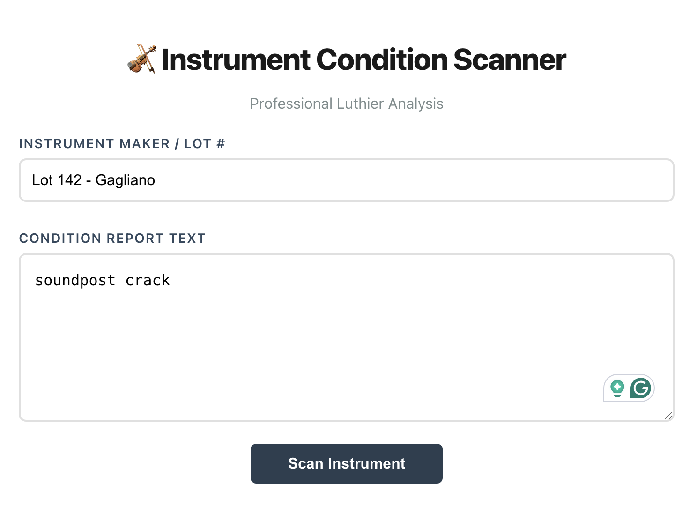
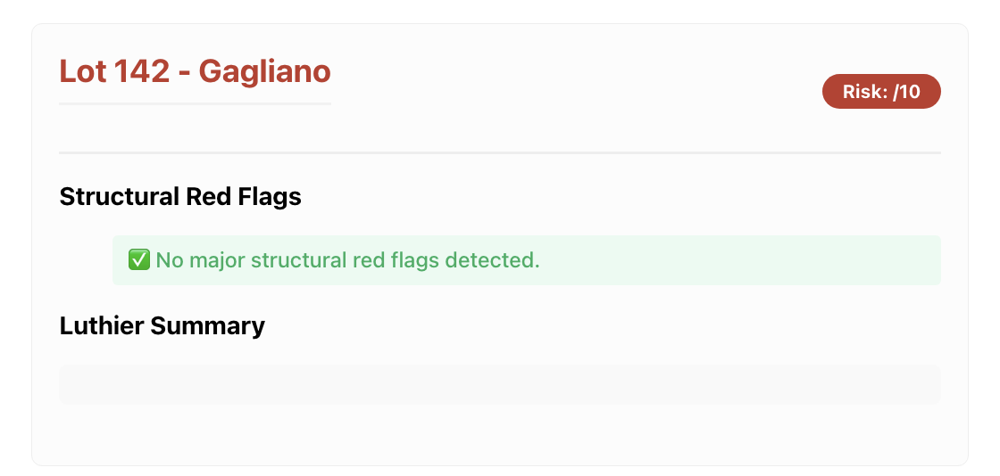

# Instrument Condition Scanner (Luthier-AI)

A full-stack web application designed to help luthiers and investors quickly assess structural risks in string instrument auction reports.

### 📸 App Preview

**1. Inputting the Condition Report**

**2. AI Structural Analysis & Risk Scoring**

### The Problem

Auction condition reports (like those from Tarisio) are often dense, technical, and unstructured. Critical defects like **soundpost cracks** or **bass bar patches** can be easily overlooked in long paragraphs of text, leading to high-risk financial decisions.

### The AI Solution

This tool leverages **Google Gemini 1.5 Flash** to act as an expert "second pair of eyes." It parses unstructured luthier terminology and extracts:

- **Structural Red Flags**: Automatic detection of cracks, patches, and non-original parts.
- **Risk Score**: A 1–10 rating based on the severity of the findings.
- **Blunt Summary**: A professional "bottom-line" warning for the user.

### Technical Stack

- **Frontend**: React.js (State management for real-time analysis)
- **Backend**: Python / FastAPI (Handles AI orchestration and API security)
- **AI Engine**: Gemini 1.5 Flash (Generative AI with custom prompt engineering)
